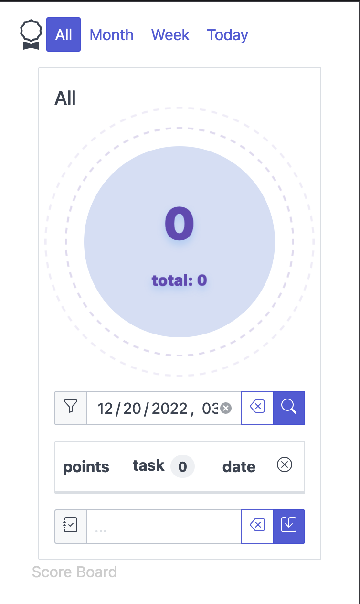

# score-board - Simple Score board 

Simple app to track score


## Features

- Use one line command to add/report new score/task
- Advanced filtering:
    - By "Month", "Week" or "Today"
    - By specific date
- One single binary (all assets embedded)

## Build project

### Build all
```
make build
```

### Build web
```
make build-web
```

### Build go
```
make build-go
```

## Used technologies

- [Go Fiber](https://gofiber.io/) - the fastest HTTP engine for Go with zero memory allocation and performance in mind.
- [spectre.css](https://picturepan2.github.io/spectre/index.html) - A Lightweight, Responsive and Modern CSS Framework
- [preact](https://preactjs.com/) - Fast 3kB alternative to React 
- [vite](https://vitejs.dev/) - Next Generation Frontend Tooling
- [bbolt](https://pkg.go.dev/go.etcd.io/bbolt) - bbolt is a fork of [Ben Johnson's Bolt](https://github.com/benbjohnson) key/value store.